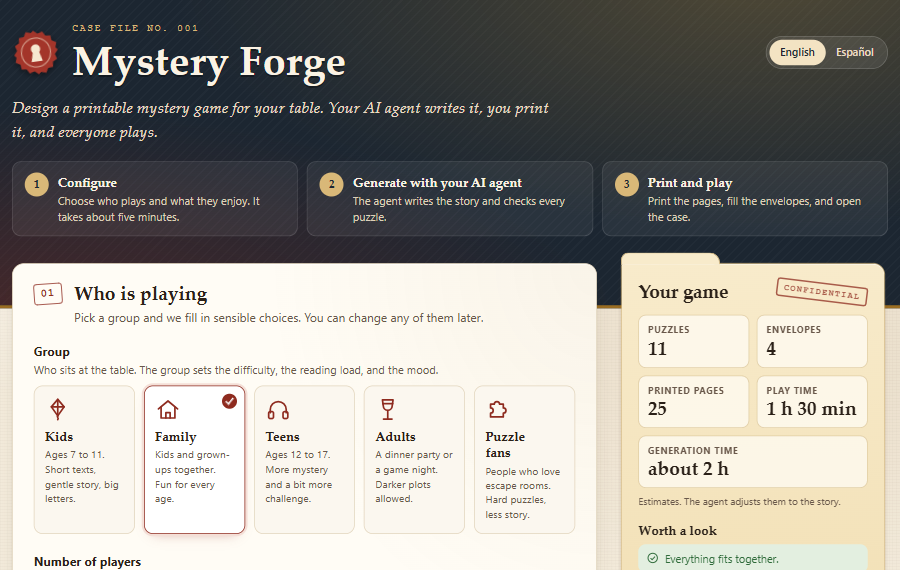
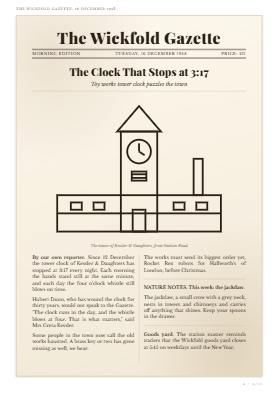
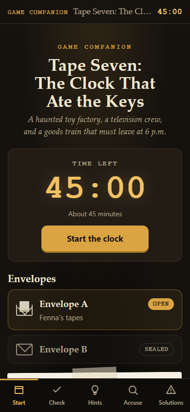

# Mystery Forge

Make your own printable mystery game for a party, a family dinner, or a quiet evening alone. You choose who plays, how long it lasts, and the language. An AI writes a new story with suspects, clues, and puzzles, tests it, and gives you files to print. You play at the table with paper, pencils, and envelopes.



| A printed page                                                       | The companion on a phone                                                                   |
| -------------------------------------------------------------------- | ------------------------------------------------------------------------------------------ |
|  |  |

## How it works, in four steps

1. **Download Mystery Forge** and unzip it.
2. **Double-click `Start Mystery Forge`.** The first time, it installs what it needs by itself.
3. **Choose your game** on a web page that opens, then let the AI make it (about 1 to 2 hours, mostly waiting).
4. **Print and play.** Open the file whose name starts with `1 -`. It tells you what to print and how to set up the envelopes.

## What you need

- **A computer** with Windows or macOS.
- **A paid Claude account** (Claude Pro or Claude Max). The AI that writes the game runs on it. Mystery Forge itself is free. One game uses a large part of what your plan allows in a few hours, so plan to make one game at a time.
- **Google Chrome or Microsoft Edge** (Windows has Edge already). It turns the game into PDF files.
- **A printer.** Black and white is fine.

## Download Mystery Forge

1. On the GitHub page of this project, click the green **Code** button, then **Download ZIP**.
2. Find the downloaded file (usually in your **Downloads** folder) and unzip it: on Windows, right-click it and choose **Extract All**; on macOS, double-click it.
3. Move the unzipped `mystery-forge` folder somewhere easy to find, such as your **Documents** folder.

## Make a game

### Step 1: start Mystery Forge

Open the `mystery-forge` folder and double-click the launcher:

- **Windows:** `Start Mystery Forge.cmd`. If Windows shows "Windows protected your PC", click **More info**, then **Run anyway**.
- **macOS:** `Start Mystery Forge.command`. The first time, macOS may refuse to open it: right-click the file, choose **Open**, then click **Open** again.

A window with text opens. The first time, it installs two free programs (uv and Claude Code). This takes a few minutes. Then it shows a short menu.

### Step 2: choose your game

1. Type **1** ("Choose a new game"). A settings page opens in your browser.
2. Choose who plays, how long the game lasts, the language, the kind of story, and what your printer can do.
3. Click **Review and save**, then **Download config**. Your browser saves a small file in your **Downloads** folder.
4. Go back to the launcher window and press **Enter**.

### Step 3: let the AI make it

1. The first time only, the AI asks you to sign in with your Claude account (your browser opens), and it asks whether you trust the folder: choose **Yes**.
2. The AI shows a summary of your choices and asks you to confirm. Then it asks you to pick one of three story ideas.
3. After that, it works alone for about 1 to 2 hours. Leave the window open and the computer on. You can do something else.

When it finishes, the AI tells you where the game is: a new folder in `Mystery Forge` on your **Desktop**.

### Step 4: print and play

Open the file whose name starts with `1 -` (the manual). It has the printing checklist, how to prepare the envelopes, and the rules. Read it before you print.

## What you get

A folder on your Desktop (`Mystery Forge/<game title>`) with:

| File                                     | What it is                                                                                                                                                                                               |
| ---------------------------------------- | -------------------------------------------------------------------------------------------------------------------------------------------------------------------------------------------------------- |
| `0 - READ FIRST (warnings).txt`          | Only when some tests of the game did not pass: which puzzles may be unclear or too hard, and how to fix them. It reveals no answer.                                                                      |
| `1 - START HERE (manual).pdf`            | Read this before you print: what to print, how to set up the envelopes, and how to play.                                                                                                                 |
| `2 - PRINT THIS (game materials).pdf`    | The game itself: letters, reports, maps, codes, and puzzles, split into envelopes by "STOP" pages, plus the answer list and the accusation form.                                                         |
| `Game companion.html`                    | An optional page for a phone or a computer. It checks your answers, shows a bit of story for each solved puzzle, gives one hint at a time, keeps the time, and scores your accusation. It works offline. |
| `HOST ONLY - spoilers/3 - Hints.pdf`     | Fold-over hint cards, for groups that play without a phone or computer.                                                                                                                                  |
| `HOST ONLY - spoilers/4 - Solutions.pdf` | Every answer and the full story. Do not open it if you want to play.                                                                                                                                     |

The file names follow the game language. A Spanish game, for example, starts with `1 - EMPIEZA AQUÍ (manual).pdf`.

## Printing tips

- Print at **actual size (100%)**, on one side of the paper. "Fit to page" breaks grids and cut-out pieces. In Chrome or Edge, click **More settings** in the Print window, then choose **Actual size** under **Scale**. In Adobe Reader, click **Actual size** under **Page Sizing & Handling**.
- **Black and white is fine.** Choose it on the configurator page, and the game uses patterns instead of colors.
- **Envelopes:** split the printed stack at each **STOP** page without reading ahead, and put each part in its own envelope (or fold it and use a clip).

## Change a game, or continue a stopped one

- **To change a finished game**, double-click the launcher, type **4** ("Talk to the AI"), and say what you want, for example "make the second puzzle easier" or "print it in black and white".
- **If the AI stopped halfway** (for example because your plan's usage limit was reached), wait until your plan allows more use, double-click the launcher, and type **3** ("Continue a stopped game").

## Languages

A game can be in any of 50 languages, from Afrikaans to Chinese. The AI writes the story and the puzzles in that language.

- **English, Spanish, Catalan, French, German, Italian, and Portuguese** have hand-checked texts for the manual, the labels, and the companion page. For other languages, the AI translates those texts for each game.
- **Japanese, Russian, Arabic, and other languages that do not use the letters A to Z** get fewer kinds of puzzles, because some puzzles (such as letter codes and Morse code) only work with A to Z.
- **Arabic, Hebrew, Persian, and Urdu** pages read from right to left.

## Install by hand

Use this only if the launcher does not work. You copy two commands into a **terminal** (a window where you type instructions to the computer), paste each one, and press **Enter**.

1. Open a terminal. **Windows:** click Start, type **PowerShell**, and press Enter. **macOS:** press **Command + Space**, type **Terminal**, and press Enter.
2. Install uv:
   - Windows: `powershell -ExecutionPolicy ByPass -c "irm https://astral.sh/uv/install.ps1 | iex"`
   - macOS: `curl -LsSf https://astral.sh/uv/install.sh | sh`
3. Install Claude Code:
   - Windows: `irm https://claude.ai/install.ps1 | iex`
   - macOS: `curl -fsSL https://claude.ai/install.sh | bash`
4. Close the terminal. Then open a terminal inside the `generator` folder: on Windows, open that folder, click the address bar, type `powershell`, and press Enter; on macOS, right-click the folder and choose **New Terminal at Folder** (it can be under **Services**).
5. Type `claude` and press Enter. Sign in when your browser opens, answer **Yes** when it asks whether you trust the folder, and type **create a game**.

If a command fails, the official pages always have the current one: [uv](https://docs.astral.sh/uv/getting-started/installation/) and [Claude Code](https://claude.com/claude-code).

## Troubleshooting

| Problem                                             | What to do                                                                                                       |
| --------------------------------------------------- | ---------------------------------------------------------------------------------------------------------------- |
| The terminal says `claude` or `uv` is not found     | Close the terminal and open a new one. If it still fails, run the install command again.                         |
| The configurator page looks empty                   | Keep the whole `configurator` folder together. The page needs the other files next to it.                        |
| The AI says it found no game settings               | Save your choices on the configurator page first (Step 1), or tell the AI where the file is.                     |
| The AI asks for permission for every step           | Close it and open the terminal inside the `generator` folder itself (Step 2), not in the `mystery-forge` folder. |
| "No browser found"                                  | Install Google Chrome or Microsoft Edge, or let the AI install a small browser for you when it asks.             |
| The AI stopped before the game was ready            | Open Claude in the `generator` folder again and type **continue**.                                               |
| Chinese, Japanese, or Arabic letters print as boxes | Your computer lacks a font for that script. Windows and macOS have them; on Linux, install the Noto fonts.       |

## How the games stay correct

AI can make mistakes, so Mystery Forge never trusts the AI to check its own puzzles:

- **Code builds the puzzles** that code can build (codes, grids, mazes, logic puzzles, locks), so they are correct by construction, and the printed pages are read back and checked.
- **Code checks the whole game:** every clue comes from a real document, no answer shows up too early, every innocent suspect can be cleared, and the game fits the time that you chose.
- **AI test players** get only what real players have and try to solve each puzzle. A puzzle that is too hard, or that has two good answers, goes back for a fix. Another group tries to name the culprit without solving any puzzle: if they can, the story goes back for a fix, because the puzzles must matter.

## For developers

The project is built and maintained with AI agents. The development map is in `AGENTS.md`.

```bash
npm install
npm run check
```

`npm run check` runs every check that CI runs: the JavaScript format, types, and tests, the Python toolkit format, lint, types, and tests (100% coverage), and the generator skill tests.

## License

MIT. See `LICENSE`. The bundled fonts keep their own open licenses, in `toolkit/src/mystery_forge/render/fonts/LICENSES/`.
